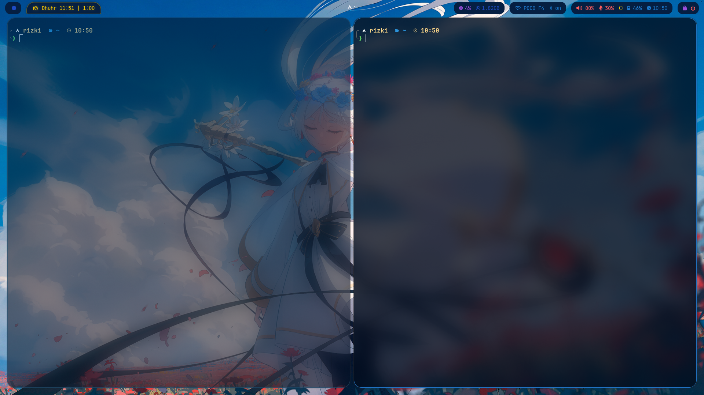
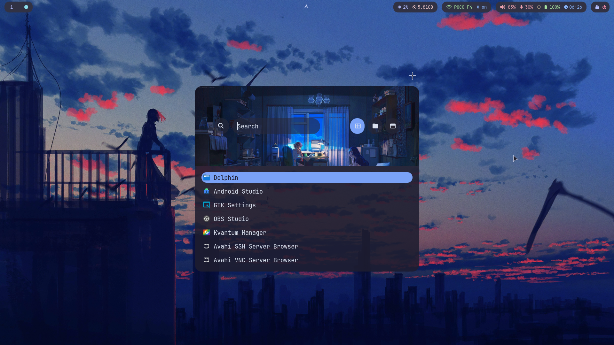
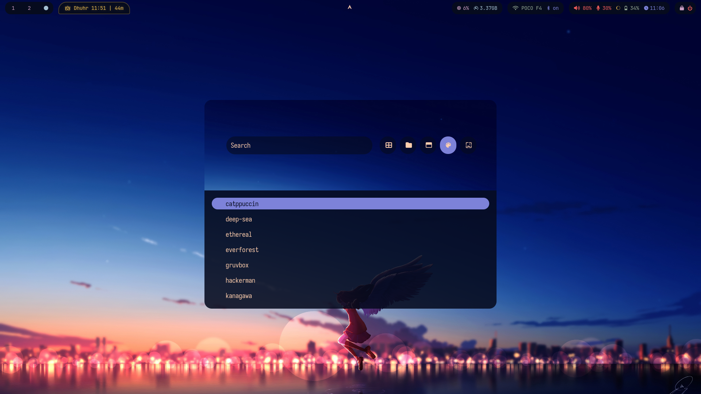
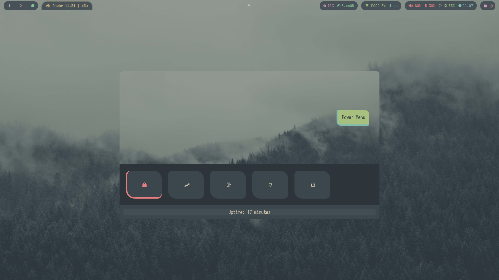

# hyprsimple

> Clean. Basic. No Fancy. Everything you need.

A **minimal aesthetics** Hyprland dotfiles collection for Arch Linux. Focused on **simplicity, beauty, and productivity** — stripped down to essentials, refined for daily use.

**Philosophy**: Every element serves a purpose. No unnecessary widgets, no distracting animations, no visual noise. Just a clean, functional workspace that gets out of your way.

---

## Preview







---

## Core Stack

| Component         | Choice          |
| ----------------- | --------------- |
| **WM**            | Hyprland        |
| **Bar**           | Waybar          |
| **Launcher**      | Wofi            |
| **Terminal**      | Ghostty         |
| **Shell**         | Bash + Starship |
| **Notifications** | Dunst           |
| **Editor**        | Neovim          |
| **Browser**       | Firefox         |
| **File Manager**  | Thunar          |

**Theme**: Catppuccin Mocha everywhere
**Packages**: 48 official + 8 AUR (see `packages.txt` and `aur-packages.txt`)

---

## Features

- **Modular configs** - Hyprland split into 12 files for easy editing
- **Consistent theming** - Catppuccin Mocha across all components
- **Wayland-native** - No X11 dependencies
- **Minimal packages** - Only 56 total packages, every one essential
- **Smart battery monitor** - Auto brightness reduction at low battery
- **GPU-aware recording** - Auto-detects NVIDIA/AMD for optimal codec
- **Interactive keybindings** - Press `SUPER + /` to view all shortcuts
- **Advanced networking** - Built-in hotspot and WiFi management

---

## Installation

### Requirements
- Arch Linux
- base-devel installed
- git installed

### For Users (Stable)

```bash
git clone https://github.com/rizukirr/hyprsimple.git
cd hyprsimple
./install.sh
```

**Copies** all files to `~/.config/`, `~/.local/bin/`, etc. Your configs become independent from the repo.

### For Developers (Live Editing)

```bash
git clone https://github.com/rizukirr/hyprsimple.git
cd hyprsimple
./dev-install.sh
```

**Symlinks** most files (except machine-specific ones). Changes in repo immediately affect your system.

### Post-Installation

1. Log out and select **Hyprland** from your display manager
2. Customize display: `nvim ~/.config/hypr/monitors.conf`
3. Set wallpaper: `nvim ~/.config/hypr/hyprpaper.conf`
4. Press `SUPER + /` to view keybindings

---

## Keybindings

Press **`SUPER + /`** for an interactive viewer with fuzzy search.

### Essential Shortcuts

| Key                     | Action                  |
| ----------------------- | ----------------------- |
| `SUPER + T`             | Terminal                |
| `SUPER + B`             | Browser                 |
| `SUPER + A`             | App Launcher            |
| `SUPER + F`             | File Manager            |
| `SUPER + O`             | Notes (Obsidian)        |
| `SUPER + Q`             | Kill window             |
| `SUPER + W`             | Toggle floating         |
| `SUPER + [1-9]`         | Switch workspace        |
| `SUPER + SHIFT + [1-9]` | Move window to workspace|

### Utilities

| Key                 | Action              |
| ------------------- | ------------------- |
| `SUPER + /`         | Keybindings viewer  |
| `SUPER + E`         | Emoji picker        |
| `SUPER + V`         | Clipboard history   |
| `SUPER + M`         | Color picker        |
| `SUPER + SHIFT + L` | Lock screen         |
| `SUPER + ESC`       | Logout menu         |

### Media

| Key                       | Action                           |
| ------------------------- | -------------------------------- |
| `SUPER + R`               | Screen record (region + mic)     |
| `SUPER + SHIFT + R`       | Screen record (full screen + mic)|
| `Print`                   | Screenshot (full)                |
| `SUPER + Print`           | Screenshot (window)              |
| `SUPER + ALT + Print`     | Screenshot (area)                |
| `XF86 Audio/Brightness`   | Volume/brightness controls       |

---

## Configuration

### Hyprland

Configs are modular in `~/.config/hypr/`:

```
hyprland.conf      → Main file (sources all below)
├── programs.conf  → App paths
├── vars.conf      → Environment variables
├── monitors.conf  → Display setup (customize this!)
├── binding.conf   → Keybindings
├── looknfeel.conf → Animations, blur, decorations
├── windows.conf   → Window rules
└── autostart.conf → Startup programs
```

**Edit any file and reload:** `hyprctl reload`

**Update keybindings:**
1. Edit `~/.config/hypr/binding.conf`
2. Press `SUPER + SHIFT + /` (or run `update-keybindings-json.sh`)
3. Press `SUPER + /` to view updated bindings

### Waybar

- `~/.config/waybar/config.jsonc` - Modules and behavior
- `~/.config/waybar/style.css` - Styling

### Custom Scripts

All in `~/.local/bin/`:
- **Notifications**: `volume-notify.sh`, `brightness-notify.sh`, `capslock-notify.sh`
- **System**: `bluetooth-toggle.sh`, `screen-record.sh`, `battery-monitor.sh`
- **Workflow**: `show-keybindings.sh`, `search_by_keyword.sh`
- **Networking**: `hotspot.sh`, `wifi.sh`

---

## Packages

**Official** (48): See `packages.txt`
**AUR** (8): See `aur-packages.txt`

Key packages:
- Hyprland ecosystem: `hyprland`, `hyprpaper`, `hyprlock`, `hypridle`, `hyprpicker`
- UI: `waybar`, `dunst`, `wofi`
- Audio: `pipewire`, `pipewire-pulse`, `wireplumber`
- CLI tools: `fzf`, `zoxide`, `starship`, `ripgrep`, `lazygit`
- Theme: `catppuccin-gtk-theme-mocha`, `catppuccin-cursors-mocha`

---

## Maintenance

### Updating Configs

**If you used `install.sh`** (files copied):
```bash
# Edit files in ~/.config/ directly
nvim ~/.config/hypr/binding.conf
hyprctl reload
```

**If you used `dev-install.sh`** (files symlinked):
```bash
# Edit files in the repo
cd ~/path/to/hyprsimple
nvim .config/hypr/binding.conf
hyprctl reload
git commit -am "Update config"
```

### Updating from Repo

```bash
cd ~/path/to/hyprsimple
git pull
./install.sh  # Re-run to update (creates backups)
```

### Updating Neovim Config

```bash
cd ~/path/to/hyprsimple
git submodule update --remote --merge
```

---

## Troubleshooting


| Problem                     | Solution                                                                 |
| --------------------------- | ------------------------------------------------------------------------ |
| Scripts not working         | Verify `~/.local/bin` is in `$PATH`: `echo $PATH`                        |
| No audio                    | Enable PipeWire: `systemctl --user enable --now pipewire pipewire-pulse wireplumber` |
| Keybinding viewer empty     | Run `update-keybindings-json.sh` or press `SUPER + SHIFT + /`           |
| Battery monitor not running | Check timer: `systemctl --user list-timers battery-monitor.timer`       |
| Hyprland won't start        | Check logs: `journalctl -b \| grep hyprland`                             |
**Check service status:**
```bash
systemctl --user status pipewire pipewire-pulse wireplumber
systemctl --user list-timers
```

**Reload everything:**
```bash
hyprctl reload
pkill waybar && waybar &
systemctl --user daemon-reload
```

---

## Contributing

This is a **personal configuration**, but suggestions are welcome!

- Report issues or suggest improvements via GitHub Issues
- Submit PRs with improvements
- Keep the minimalist philosophy
- Maintain Wayland-only compatibility
- Follow existing patterns

---

## License

**MIT License** - Use, modify, and share freely.

---

**Note**: Neovim config is a separate submodule from [rrxxyz/nvim-minimal](https://github.com/rrxxyz/nvim-minimal)
